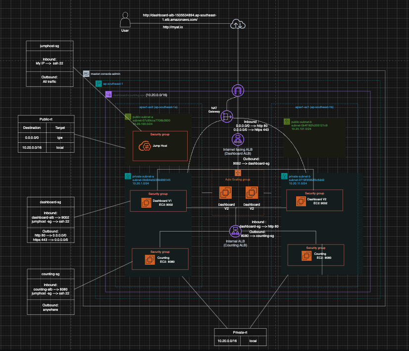
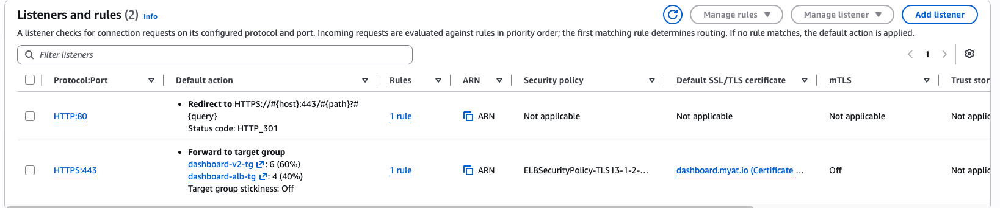
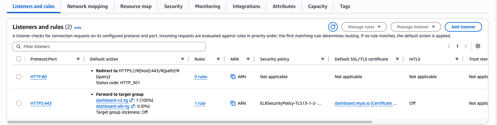
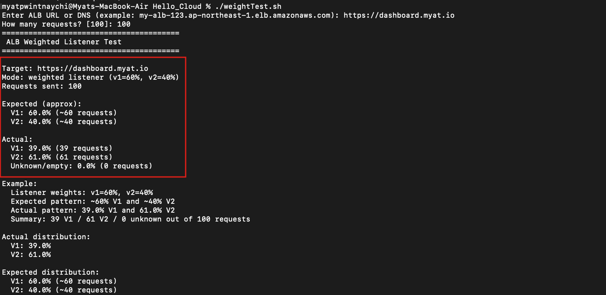
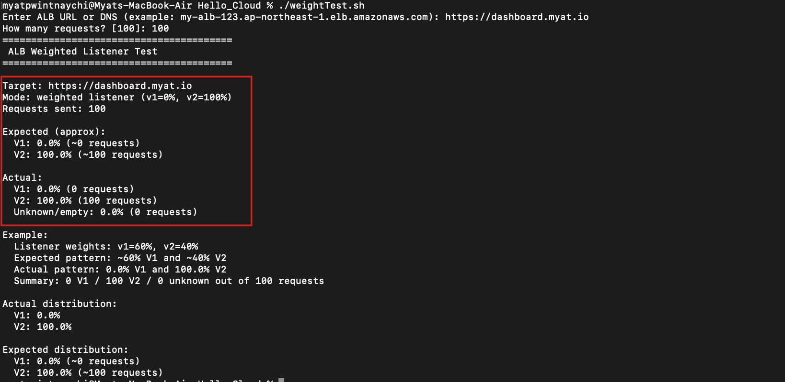
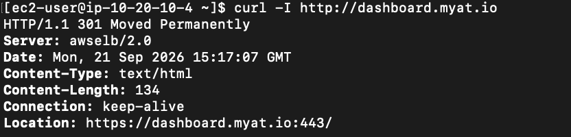
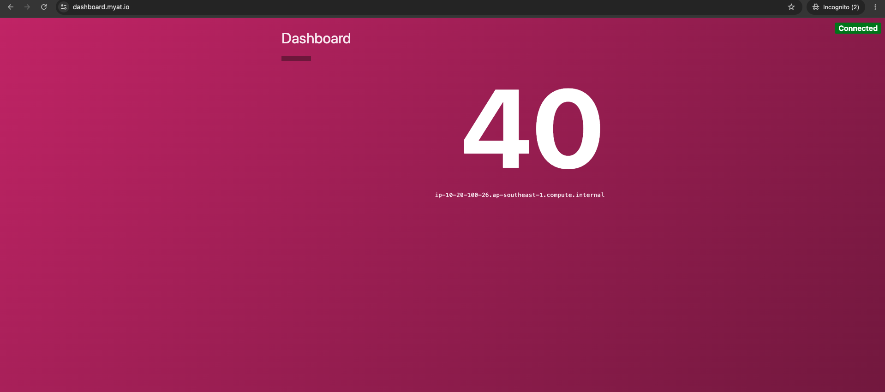
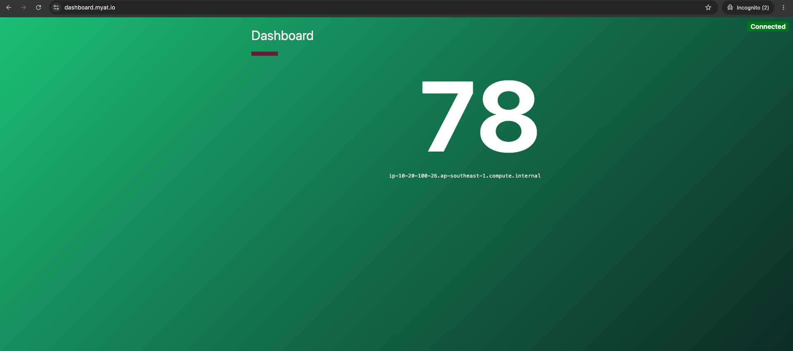

#  Multi-Tier Microservice Infrastructure & Blue/Green Deployment on AWS

An end-to-end AWS cloud infrastructure project demonstrating zero-downtime Blue/Green deployments, private microservice architecture, and secure administrative access via a Jump Host.

---

##  Architecture Summary


This infrastructure is deployed inside a custom multi-AZ VPC (`dashboard-counting-vpc`) in the **ap-southeast-1** (Singapore) region.

* **VPC Network:** 2 Public Subnets & 2 Private Subnets spanning 2 Availability Zones (`ap-southeast-1a` & `ap-southeast-1b`).
* **Public Tier (`dashboard-alb`):** Internet-facing Application Load Balancer handling user requests and performing HTTP-to-HTTPS redirection.
* **Frontend/Dashboard Tier:** EC2 instances hosted in private subnets, managed via Auto Scaling Groups (ASG) and Target Groups.
* **Internal Microservice Tier (`counting-alb` & `Counting EC2`):** Private Application Load Balancer routing internal microservice calls from Dashboard instances to backend Counting workers.
* **Bastion Tier (`Jump Host`):** Public SSH gateway configured with dedicated Security Groups for administrative access and initial application setup.

---

##  Architecture Diagram

---

## Blue/Green Deployment Strategy

To achieve zero-downtime releases for the `dashboard` application:

1. **Target Group & ASG Setup:** Deployed `dashboard_v2` (Green) into an Auto Scaling Group attached to its own Target Group alongside `dashboard_v1` (Blue).
2. **Weighted Traffic Split (60/40 Canary Test):** Configured `dashboard-alb`  listener rules to split live user traffic:
   * **`dashboard_v2` (Green):** ~60%
   * **`dashboard_v1` (Blue):** ~40%
  


3. **Full Cutover (100% Shift):** Shifted 100% of traffic to `dashboard_v2` after verification.



4. **Listener Optimization:** Implemented a standard HTTP-to-HTTPS 301 redirection rule on port 80.

##  Verification & Load Testing

A custom shell script (`weightTest.sh`) was executed to issue 100 sequential requests to the public HTTPS domain (`https://dashboard.myat.io`) to validate traffic distribution across deployment phases.

### Phase 1: Weighted Traffic Split Test (60% Green v2 / 40% Blue v1)

* **Target URL:** `https://dashboard.myat.io`
* **Requests Sent:** 100
* **Test Result:**
  * **v1 (Blue):** 39% (39 requests)
  * **v2 (Green):** 61% (61 requests)
  * **Success Rate:** 100% (0 unknown/empty requests)



---

### Phase 2: Full Cutover Test (100% Green v2 / 0% Blue v1)

* **Target URL:** `https://dashboard.myat.io`
* **Requests Sent:** 100
* **Test Result:**
  * **v1 (Blue):** 0% (0 requests)
  * **v2 (Green):** 100% (100 requests)
  * **Success Rate:** 100% (0 unknown/empty requests)



---

## Security & Traffic Flow Rules

1. **HTTP to HTTPS Redirect:** Configured on dashboard-alb to redirect all HTTP (port 80) traffic to HTTPS (port 443).
   


3. **Strict Inbound Filtering:** Private instances (dashboard and counting) only accept application traffic from their respective load balancer security groups and administrative SSH from jumphost-sg.

| Security Group | Inbound Rules | Outbound Rules | Purpose |
| :--- | :--- | :--- | :--- |
| **`jumphost-sg`** | `22 (SSH)` from Admin IP | All Traffic | Secure Bastion Host |
| **`dashboard-sg`** | `9002` from `dashboard-alb`<br>`22` from `jumphost-sg` | `80` to `internal-counting-alb` | Dashboard App Tier |
| **`counting-sg`** | `8080` from `internal-counting-alb`<br>`22` from `jumphost-sg` | Internet / Any | Private Microservice Tier |

---

## Administrative SSH Tunneling

To access private EC2 instances for setup, configuration, or debugging:

```bash
# Connect through the Jump Host to private instances
ssh -J ec2-user@<JUMP_HOST_PUBLIC_IP> ec2-user@<PRIVATE_INSTANCE_IP>

```
**Dashboard V1:**


**Dashboard V2:**

